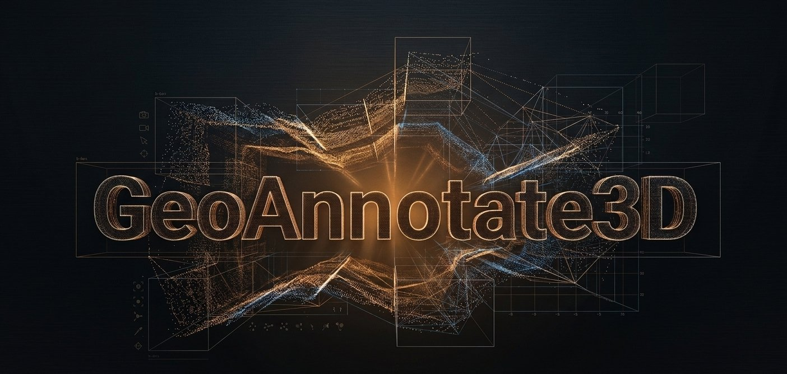

<div align="center">

# GeoAnnotate3D

### End-to-end GeoAI workflow for LiDAR point clouds in a single desktop application

[](https://www.gnu.org/licenses/agpl-3.0)
[](https://www.python.org/downloads/)
[]()
[]()

Visualize, annotate, train, and run inference on massive LiDAR point clouds in one offline desktop tool.

[Download](#download) · [Installation](#installation) · [Documentation](docs/) · [Report Issue](https://github.com/YOUR_USERNAME/GeoAnnotate3D/issues)



</div>

---

## About

GeoAnnotate3D is a free, offline desktop application that integrates the complete workflow for LiDAR point cloud annotation and deep learning model training in a single environment. It allows users to load, visualize, annotate, export, train, and run inference with custom classification models on massive point clouds, without relying on commercial licenses or cloud services.

Designed for researchers, universities, independent professionals, geomatics teams, and organizations working with LiDAR and GeoAI.

---

## Workflow
Load → Preclassify → Label → Generate Dataset → Train → Infer → Correct → Retrain

All within a single application. Offline. No subscriptions.

---

## Features

### Point Cloud Loading
- Supported formats: LAS, LAZ, E57, PLY, NPY
- Tested with point clouds up to 1.6 billion points on conventional hardware
- Tested up to 9 billion points on high-performance workstations
- Progressive Level-of-Detail rendering and spatial tile management
- Automatic import of existing classification (ASPRS and custom)

### Geospatial Preclassification
- CSF (Cloth Simulation Filter) for ground detection
- AGL (Height Above Ground) for height-based classification
- Automatic separation of ground, vegetation, buildings, and other categories

### 3D Annotation Tools
- Spherical brush with adjustable radius
- 2D/3D polygon
- Selection box
- Region growing
- Support for georeferenced orthomosaics (.tif)
- Support for vector layers (.shp) with real coordinates
- Real-time class color and name editor

### Deep Learning Dataset Generation
- Direct export ready for PyTorch
- Automatic train/val/test split
- No intermediate conversion steps

### Integrated Model Training
- RandLA-Net (fast, ideal for large point clouds)
- PointNet++ (multi-scale, high geometric accuracy)
- KPConv (fine detail at edges)
- Real-time monitoring of Loss and mIoU
- CUDA (GPU) and CPU support
- Custom models trained on your own classes and data

### Integrated Inference
- Patch-based inference with overlap blending on full point clouds
- Result visualization directly in the 3D canvas
- Correction with annotation tools and progressive retraining

---

## Download

Download the Windows installer from the [Releases section](https://github.com/YOUR_USERNAME/GeoAnnotate3D/releases/latest):

**[GeoAnnotate3D_Setup_v1.0.0.exe](https://github.com/YOUR_USERNAME/GeoAnnotate3D/releases/latest)**

The installer includes Python, PyTorch, and all required dependencies. No additional setup needed.

**System Requirements:**
- Windows 10/11 (64-bit)
- 8 GB RAM minimum (16 GB recommended)
- NVIDIA GPU with CUDA 12.x (optional, accelerates training)
- 5 GB disk space

---

## Installation

1. Download the `.exe` installer from [Releases](https://github.com/YOUR_USERNAME/GeoAnnotate3D/releases/latest)
2. Run the installer
3. Follow the setup wizard
4. Open GeoAnnotate3D from the Start Menu or desktop shortcut

On first launch, the software will automatically download PyTorch (CUDA build if an NVIDIA GPU is detected, CPU build otherwise). This may take 5 to 15 minutes depending on your connection.

---

## Documentation

- [Quick Start Guide](docs/quickstart.md)
- [Complete User Manual](docs/user-guide.md)
- [Step-by-step Tutorial with Examples](docs/tutorial.md)
- [Frequently Asked Questions](docs/faq.md)

---

## Demo

[](https://www.youtube.com/watch?v=YOUR_VIDEO_ID)

---

## Screenshots


*Loading and visualization of massive point clouds*


*Labeling with overlaid orthomosaics*


*Integrated training with mIoU monitoring*


*Inference on the full point cloud*

---

## Applications

- Forest inventories and vegetation analysis
- Urban and road infrastructure classification
- Cadastre, mining, and territorial planning
- Academic research in GeoAI
- Development of custom classification models for point clouds

---

## Architecture

Technology stack:
- Python 3.11 + PyQt5 for the user interface
- VTK for 3D rendering
- PyTorch for training and inference
- NumPy / SciPy for numerical processing
- laspy / pye57 for LiDAR format support
- CSF (Cloth Simulation Filter) integrated

---

## Contributing

Contributions are welcome. Read the [contribution guide](CONTRIBUTING.md) to get started.

You can help by:
- Reporting bugs
- Suggesting new features
- Improving the documentation
- Contributing code through pull requests
- Sharing the project

---

## Citation

If you use GeoAnnotate3D in research, please cite it as follows:

```bibtex
@software{geoannotate3d_2026,
  author       = {Yutlani},
  title        = {GeoAnnotate3D: Integrated GeoAI Workflow for LiDAR Point Cloud Annotation and Neural Network Training},
  year         = {2026},
  url          = {https://github.com/YOUR_USERNAME/GeoAnnotate3D},
  version      = {1.0.0}
}
```

---

## License

This project is licensed under the GNU Affero General Public License v3.0 (AGPL-3.0). See the [LICENSE](LICENSE) file for details.

---

## Author

**Yutlani** — GIS and GeoAI Developer  
[LinkedIn](https://www.linkedin.com/in/yutlani) · [GitHub](https://github.com/YOUR_USERNAME)

Guadalajara, Mexico

---

## Acknowledgments

GeoAnnotate3D uses these open-source libraries:
- [PyTorch](https://pytorch.org/) for the deep learning framework
- [VTK](https://vtk.org/) for the 3D rendering engine
- [PyQt5](https://riverbankcomputing.com/software/pyqt/) for the graphical interface
- [laspy](https://github.com/laspy/laspy) for LAS/LAZ file support
- [CSF](https://github.com/jianboqi/CSF) for the ground detection algorithm

Inspired by tools such as CloudCompare, Supervisely, LP360, and LiDAR360, with the goal of making the complete GeoAI workflow for point clouds more broadly accessible.
